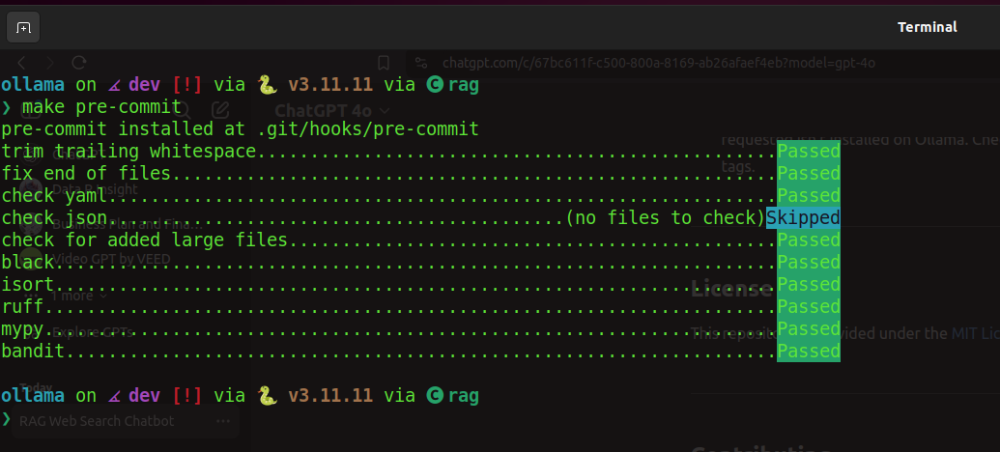
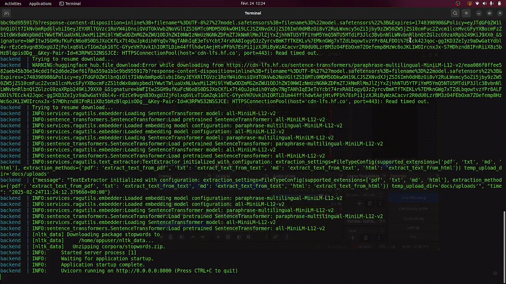
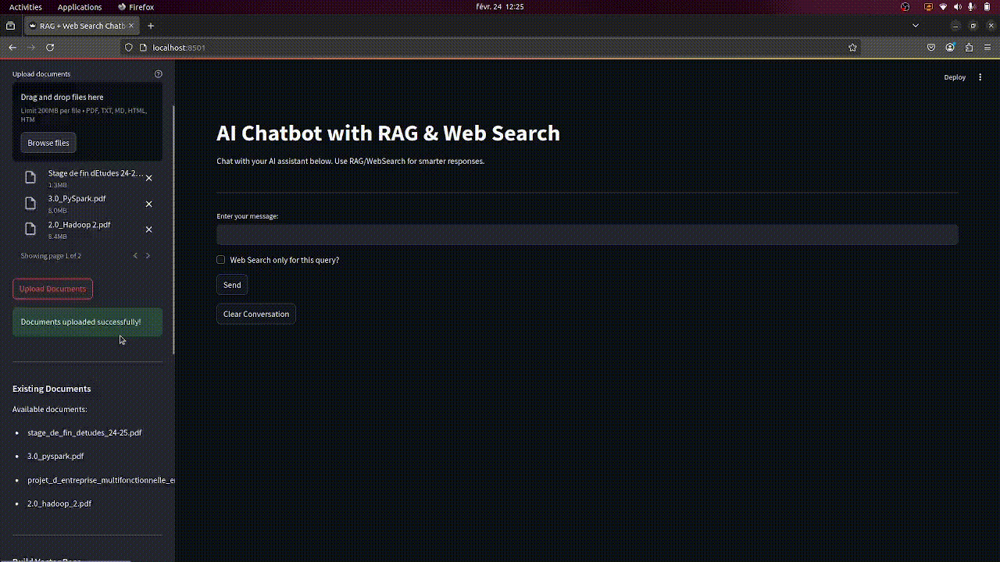
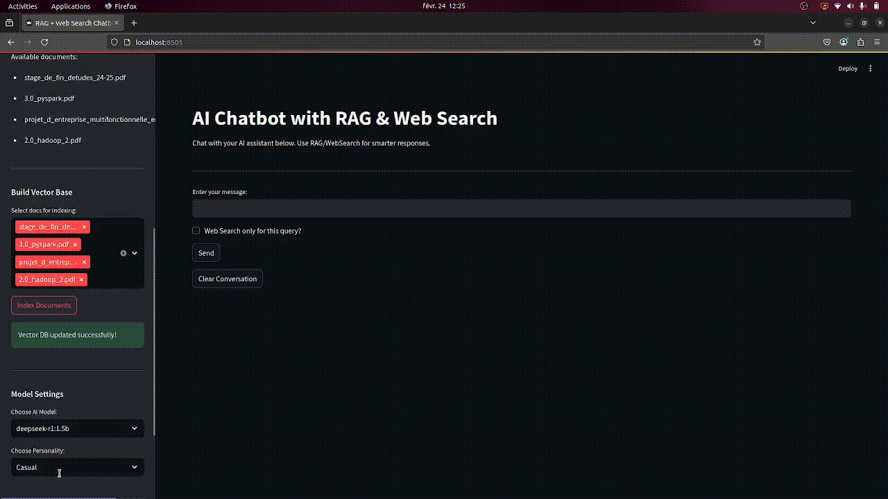

# RAG + Web Search Chatbot

A **Retrieval-Augmented Generation (RAG)** system that integrates **ChromaDB** for vector similarity search, an **Ollama** language model for LLM-based responses, optional **web search**, and a **Streamlit**-based frontend.

The goal is to provide a complete end-to-end pipeline for uploading documents, indexing text content, and chatting with an LLM that can reference both local documents and live web searches.


### You will see demonstration videos below.
---

## Pre-commit Success Screenshot

Below is a screenshot showing **pre-commit** hooks passing successfully:



---

## Key Features

1. **Document Upload & Management**
   - Upload PDFs, TXT, MD, or HTML files.
   - Extract text, store them in ChromaDB for vector-based retrieval.

2. **ChromaDB Integration (RAG)**
   - Perform similarity search on local documents.
   - Query retrieved chunks to provide context during the LLM chat.

3. **Web Search**
   - Leverage DuckDuckGo to fetch relevant web snippets in real-time.
   - Integrate these snippets into the AI prompt.

4. **Ollama LLM Integration**
   - Use Ollama with locally available models (e.g., `llama3.2`, `deepseek-r1`).
   - Support streaming responses (SSE) or standard request/reply.

5. **API & Frontend**
   - **Backend**: [FastAPI](https://fastapi.tiangolo.com/) application that exposes endpoints to manage documents, search ChromaDB, and chat with the LLM.
   - **Frontend**: [Streamlit](https://streamlit.io/) application for an interactive chatbot UI.

6. **Docker-Compose for Orchestration**
   - Three services: **backend**, **frontend**, **ollama**.
   - Spin up everything with `docker compose up --build`.

---

## Directory Structure

```bash
amiche02-ollama/
├── README.md
├── Dockerfile.backend
├── Dockerfile.frontend
├── Dockerfile.ollama
├── docker-compose.yml
├── docker-compose.override.yml
├── entrypoint.sh
├── makefile
├── backend/
│   ├── main.py
│   ├── routes/
│   ├── services/
│   ├── workflow/
│   └── ...
├── front-end/
│   └── app.py
├── requirements/
│   ├── requirements.txt
│   ├── requirements.dev.txt
│   └── requirements.frontend.txt
└── .github/
    └── workflows/
        └── ...
```

- **backend/**: FastAPI application, routes, services, tests, workflows.
- **front-end/**: Streamlit application, including `app.py`.
- **entrypoint.sh**: Custom script to start Ollama and pull models at container startup.
- **Dockerfiles**: Each service has its own Dockerfile for isolation.
- **docker-compose.yml**: Orchestrates the three services.

---

## Quick Start

### 1. Clone the Repository

```bash
git clone https://github.com/Amiche02/ollama.git
cd ollama
```

### 2. Build & Run (Docker Compose)

Make sure you have **Docker** and **Docker Compose** (or the Docker Engine with Compose plugin) installed.

1. **Pull or build** the images:
   ```bash
   docker compose up --build -d
   ```
2. Containers:
   - **backend**: Runs FastAPI on port `8000`.
   - **frontend**: Runs Streamlit on port `8501`.
   - **ollama**: Ollama server on port `11434`.

3. **Access the app**:
   - Frontend (Streamlit): [http://localhost:8501](http://localhost:8501)
   - Backend (FastAPI): [http://localhost:8000/docs](http://localhost:8000/docs) for the interactive docs.

### 3. Stopping Containers

```bash
docker compose down
```

Or remove everything (containers, volumes, networks, images):

```bash
docker compose down --rmi all --volumes
```

---

## Local Development (Optional)

If you prefer to run the backend locally:

1. **Create a virtual environment** (Conda or uv):
   ```bash
   make init
   ```

2. **Install dependencies**:
   ```bash
   make requirements
   ```

3. **Run the backend**:
   ```bash
   make run
   ```
   This starts FastAPI on `http://127.0.0.1:8000`.

4. **Frontend** can be launched with:
   ```bash
   streamlit run front-end/app.py --server.port=8501
   ```

(You still need to run Ollama somehow—either in Docker or installed locally.)

---

## Using the Application

### 1. Upload Documents



From the **Streamlit** sidebar:
1. Click **Upload Documents**.
2. Select multiple `.pdf`, `.txt`, `.md`, or `.html` files.
3. Press **Upload Documents** to store them on the backend.

### 2. Vector Indexing



1. See a list of available documents in the sidebar.
2. Select the docs you want to index.
3. Press **Index Documents** to extract text, chunk, embed, and store in ChromaDB.

### 3. Chat
On the main page:
1. Choose an **AI Model** (must be recognized by Ollama).
2. Choose a **Personality** (e.g., "Casual", "DeepThinker", etc.).



3. Toggle **RAG** to retrieve from ChromaDB (your uploaded docs).


4. Toggle **Web Search** to incorporate real-time DuckDuckGo results.


5. (Optional) **Enable Streaming** to stream partial responses.


6. Type your query and press **Send**.

---

## FastAPI Endpoints

Below is a summary of the main endpoints (see also `backend/info.md`):

- **Health Check**: `GET /health`
- **File Manager**
  - `POST /docs/upload/`: Upload one or more files.
  - `GET /docs/list/`: List uploaded filenames.
  - `DELETE /docs/delete/{filename}`: Remove a file.
- **Text Extraction & Indexing**
  - `POST /text-extraction/extract_and_store/`: Extract & store in ChromaDB.
- **ChromaDB**
  - `GET /chromadb/list/`: List indexed documents.
  - `POST /chromadb/query/`: Query using a text embedding.
  - `DELETE /chromadb/delete/{filename}`: Delete a specific doc from the index.
  - `DELETE /chromadb/clear/`: Clear the entire ChromaDB.
- **Web Search**
  - `POST /websearch/search/`: Perform a DuckDuckGo search & index results in ChromaDB.
- **Chat**
  - `POST /chat/message/`: Send a chat request.
  - `GET /chat/available_models/`: List models recognized by Ollama.
  - `GET /chat/history/`: Retrieve conversation.
  - `DELETE /chat/clear_history/`: Clear conversation.

---

## Testing & Linting

1. **Pre-commit Hooks**:
   Run checks (Black, Isort, Ruff, Mypy, Bandit, etc.) using:
   ```bash
   pre-commit run --all-files
   ```

2. **Pytest**:
   Tests are located within `backend/tests/`. For example, you can run:
   ```bash
   pytest backend/tests
   ```

3. **Docker Container Structure Tests**:
   There are YAML configs in `backend/tests/cst-backend.yml` and `front-end/tests/cst-frontend.yml` that run [Google’s Container Structure Tests](https://github.com/GoogleContainerTools/container-structure-test).
   You can see them running in the GitHub Actions CI pipeline.

---

## GitHub Actions CI/CD

- **ci.yml**: Runs linting & tests on push/pull-request to `main` or `dev`.
- **backend-ci.yml**: Builds and pushes the **backend** Docker image, then runs container-structure-test.
- **frontend-ci.yml**: Builds and pushes the **frontend** Docker image, then runs container-structure-test.

Make sure you configure **Docker Hub** credentials via GitHub Secrets if you want to push images.

---

## Troubleshooting

- **Ollama not starting**: Check your Docker logs for the `ollama` container. Make sure the `entrypoint.sh` script can pull the required models.
- **ChromaDB volume**: A local volume is created named `chroma_db`. If you want to persist or remove it, you can manage volumes with `docker volume ls` and `docker volume rm`.
- **Model not found**: The `POST /chat/message/` endpoint will fail if the `model_name` you requested isn’t installed on Ollama. Check `GET /chat/available_models/` for the actual model tags.

---

## License

This repository is provided under the [MIT License](LICENSE) (feel free to update accordingly).

---

## Contributing

1. Fork the repo & create a feature branch.
2. Make changes & run pre-commit hooks/tests.
3. Submit a Pull Request.

PRs are welcome! For major changes, open an issue first to discuss.

---

**Enjoy your RAG + Web Search Chatbot!** If you have questions or run into issues, please open a GitHub Issue or PR.
